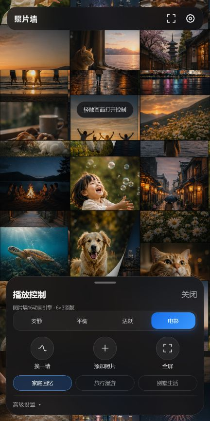

# PhotoWall · 照片墙

一款致敬 Apple TV 经典照片墙体验的 Windows 桌面应用。让照片在整面屏幕上翻滚、旋转、飘落和缓慢推进，把普通文件夹变成一面会呼吸的回忆墙。

> PhotoWall 是独立开源项目，与 Apple Inc. 无隶属或合作关系。

<p align="center">
  
</p>

[下载最新版](https://github.com/linagent/lin-photo-wall/releases/latest) · [查看构建状态](https://github.com/linagent/lin-photo-wall/actions)

## 功能亮点

- 多种动态效果：翻滚、横向翻滚、顶点旋转、落叶飘与缓慢缩放
- 支持选择本机照片文件夹和拖拽导入
- 家庭回忆、旅行漫游、别墅生活等演示主题
- 照片只在本机处理，不会上传
- 支持 Windows x64 与 Windows ARM64
- 基于 Tauri 2，提供安装版与免安装便携版

## 下载与使用

前往 [Releases](https://github.com/linagent/lin-photo-wall/releases/latest) 下载适合设备的版本：

- 大多数 Windows 电脑：`PhotoWall-x64-setup.exe`
- 免安装运行：`PhotoWall-x64-portable.exe`
- Windows ARM 设备：选择文件名中带 `arm64` 的版本

首次运行未签名应用时，Windows 可能显示 SmartScreen 提示。确认文件来自本仓库后，可选择“更多信息 → 仍要运行”。

## 隐私

PhotoWall 不会将照片上传到服务器。文件夹扫描、缩略图生成和播放均在本机完成，缩略图缓存保存在应用的本地数据目录中。

## 开发

- 前端：原生 HTML、CSS、JavaScript
- 桌面框架：Tauri 2
- 后端：Rust
- 自动构建：GitHub Actions

```bash
cargo install tauri-cli --version "^2"
cargo tauri dev
```

## 反馈

如果你喜欢这面照片墙，欢迎 Star、提交 Issue，或者分享你希望加入的动画和主题。
